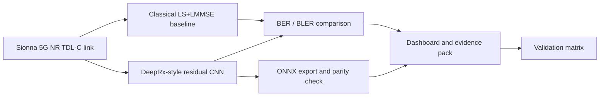

# Neural Receiver - 5G NR AI-PHY Evidence Pack

This project is a controlled AI-PHY benchmark, not a production neural receiver claim.

I built it to answer one engineering question: can a DeepRx-style neural receiver outperform a classical LS+LMMSE receiver on the same Sionna-modeled 5G NR TDL-C link, and where does that advantage break down?

The answer is bounded. The neural receiver shows its strongest advantage in the moderate-SNR region. The classical baseline remains competitive at high SNR. That boundary is part of the result, not a weakness to hide.

## Open The Evidence Pack

> [▶ Open the live dashboard](https://obiedeh.github.io/ai-phy-neural-receiver-benchmark/reports/dashboard.html) · [Landing page](https://obiedeh.github.io/ai-phy-neural-receiver-benchmark/reports/index.html) · [Business case](BUSINESS_CASE.md) · [Technical brief](TECH_BRIEF.md) · [Validation matrix](VALIDATION_MATRIX.md)

GitHub shows committed HTML files as source code. Use the live GitHub Pages links above to open the rendered dashboard and landing page.

## Positioning

Do not read this repo as "I invented neural receivers." That would be the wrong claim.

Read it as:

> A reproducible AI-PHY evidence pack that compares a learned receiver against a classical LS+LMMSE chain on the same Sionna-modeled 5G NR channel, validates ONNX parity, exposes the measured limits, and defines the next validation gates before any AI-RAN deployment claim.

That is the value: fair comparison, measured evidence, export validation, and honest boundaries.

## Headline Evidence

| Signal | Value | Source |
|---|---:|---|
| BER @ 5 dB, classical LS+LMMSE | 0.122 | `reports/bler_comparison.csv` |
| BER @ 5 dB, neural receiver | 0.062 | `reports/bler_comparison.csv` |
| BER @ 10 dB, classical | 0.026 | `reports/bler_comparison.csv` |
| BER @ 10 dB, neural | 0.014 | `reports/bler_comparison.csv` |
| BLER @ 12.5 dB, classical | 0.938 | `reports/bler_comparison.csv` |
| BLER @ 12.5 dB, neural | 0.585 | `reports/bler_comparison.csv` |
| Moderate-SNR neural advantage | about 2-3 dB effective BER gain | `reports/bler_comparison.svg` |
| ONNX parity | PASS, max_diff=1.38e-05 | `reports/onnx_parity_test.json` |
| Test suite | 31/31 passing | `tests/` |
| Deterministic pilot bug | found and fixed | `neural_rx/sionna_link.py` |

## Why This Exists

Neural PHY claims are easy to overstate. A learned receiver is only useful if it is compared against a fair classical baseline under the same link assumptions, with artifacts that another engineer can inspect.

This repo compares a DeepRx-style residual CNN receiver against a classical LS+LMMSE+soft-demap path under the same Sionna 5G NR TDL-C/QPSK/SISO conditions. It packages the result as code, CSV, plots, ONNX parity evidence, and a static dashboard.

The goal is not hype. The goal is a decision-grade evidence pattern for AI-native receiver validation.

## Problem

Receiver design affects link reliability. If a learned receiver improves the BER/BLER curve under controlled channel conditions, it may create margin for future AI-native radio systems. But that only matters if the comparison is fair, reproducible, and bounded.

## Goal / Aim

Build a controlled AI-PHY evidence pack:

- same modeled 5G NR link
- same channel family
- same SNR sweep
- classical LS+LMMSE baseline
- DeepRx-style neural receiver
- measured BER/BLER curves
- ONNX export parity
- explicit deployment boundaries
- next-step validation matrix

## Solution / What I Built

I built a DeepRx-style residual CNN receiver on a Sionna-modeled 5G NR TDL-C link and compared it against a classical LS+LMMSE+soft-demap receiver under the same channel setup.

- Sionna 2.0 link model
- 3GPP TR 38.901 TDL-C channel
- QPSK / CP-OFDM / SISO
- LS+LMMSE baseline
- DeepRx-style CNN with about 373,154 trainable parameters
- BER/BLER sweeps
- ONNX export and parity test
- deterministic pilot fix
- static dashboard and committed evidence artifacts

## Architecture



## Engineering Interpretation

| Region | Neural receiver behavior | Classical receiver behavior | Interpretation |
|---|---|---|---|
| Low SNR | Improves BER, but frame errors remain high | Also frame-error limited | Useful signal, not an operating-point victory |
| Moderate SNR | Strongest measured advantage | Falls behind under the same link conditions | Best current evidence for learned receiver value |
| High SNR | No longer dominates | Remains competitive | The result is not "neural always wins" |

## Business / Engineering Case

This is not a consumer business case. It is an engineering case for AI-native radio work.

Before a learned receiver can be discussed in AI-RAN, O-RAN, SDR, or hardware terms, it needs a fair simulated-link comparison against a classical receiver. This repo provides that evidence pattern.

The engineering value is knowing where the neural receiver helps, where classical remains strong, and what must be validated before deployment claims become credible.

## Engineering Practices That Matter

- Fair baseline comparison against LS+LMMSE, not a weak straw man.
- Same Sionna link conditions for neural and classical paths.
- Deterministic pilot bug found and fixed with `sionna.phy.config.seed`.
- ONNX parity check verifies export correctness.
- Reproducible reports generated from committed CSV/SVG/JSON artifacts.
- Tests passing in the recorded evidence.
- Training cost measured: 10.4 min / 100k steps on RTX 5090, batch=64.
- High-SNR limitation disclosed instead of buried.

## What This Is

| Layer | What it does |
|---|---|
| Link model | Sionna-modeled 5G NR TDL-C channel |
| Classical receiver | LS pilot estimation, LMMSE equalization, max-log soft demapping |
| Neural receiver | DeepRx-style CNN that learns joint receiver behavior |
| Evaluation | BER/BLER sweep across SNR |
| Export check | ONNX parity validation |
| Dashboard | Static evidence pack for measured results |
| Validation matrix | Next gates needed before stronger AI-RAN claims |

## What This Is Not

| Claim | What is true instead | Limit it protects |
|---|---|---|
| Novel neural receiver research | No, neural receivers already exist in research and vendor work | Avoids inflated novelty claims |
| Live 5G deployment | No, this is simulated link evidence | Prevents production overclaiming |
| SDR validated receiver | No, no hardware-loop validation yet | Keeps hardware claims honest |
| O-RAN/gNB integration | No, no RAN integration is claimed | Separates link evidence from RAN integration |
| NVIDIA Aerial integration | No, this uses Sionna, not Aerial | Avoids vendor integration theater |
| MIMO receiver | No, this is SISO unless implemented otherwise | Keeps antenna scope clear |
| Higher-order QAM / LDPC-coded system | No, QPSK and current uncoded scope only as implemented | Avoids unmeasured PHY claims |
| Production-ready AI-RAN component | No, this is a research-grade evidence pack | Preserves deployment boundary |

## Validation Matrix

The next credible upgrades are not more marketing. They are harder validation gates.

| Gate | Current state | Why it matters |
|---|---|---|
| 16-QAM / 64-QAM | Not implemented | QPSK-only can look toy-like if not bounded |
| LDPC-coded BLER | Not implemented | Real 5G link decisions care about transport block success |
| Doppler / mobility sweep | Not implemented | AI-PHY value depends on channel dynamics |
| MIMO or SIMO | Not implemented | SISO caps receiver realism |
| ONNXRuntime / TensorRT latency | ONNX parity only | Export correctness is not runtime suitability |
| Channel mismatch test | Not implemented | Shows whether the neural receiver generalizes or overfits |
| SDR / OAI hardware loop | Not implemented | Required before hardware-facing AI-RAN claims |

See [VALIDATION_MATRIX.md](VALIDATION_MATRIX.md) for the full validation plan.

## Technical Workflow

| Stage | Output |
|---|---|
| Sionna link config | shared TDL-C/QPSK/SISO link setup |
| Classical baseline sweep | `reports/bler_classical.csv` and plot |
| Neural receiver training | `reports/training_log.json` |
| Head-to-head BER/BLER comparison | `reports/bler_comparison.csv` and plot |
| ONNX export | `models/neural_rx.onnx` when generated |
| Parity check | `reports/onnx_parity_test.json` |
| Dashboard generation | `reports/index.html`, `reports/dashboard.html` |
| Tests / verify | pytest, ruff, `make verify` |

## Core Stack

Python, PyTorch, Sionna 2.0, NumPy, matplotlib, ONNX, ONNXRuntime, pytest.

## Reproducibility

```bash
pip install -e ".[dev]"
python scripts/run_bler_classical.py
python scripts/train_neural_rx.py --steps 100000
python scripts/run_bler_comparison.py
python scripts/export_onnx.py
python build_dashboard.py
make verify
```

`make verify` expects a trained checkpoint in `models/neural_rx_best.pt`.

## Run This Demo

```bash
python scripts/run_bler_classical.py
python scripts/run_bler_comparison.py
python scripts/export_onnx.py
python build_dashboard.py
```

Then open:

- [Live landing page](https://obiedeh.github.io/ai-phy-neural-receiver-benchmark/reports/index.html)
- [▶ Open the live dashboard](https://obiedeh.github.io/ai-phy-neural-receiver-benchmark/reports/dashboard.html)
- [Local dashboard artifact](reports/dashboard.html)

## Boundaries

- No live 5G network.
- No SDR validation.
- No gNB/O-RAN integration.
- No NVIDIA Aerial integration.
- No hardware-loop validation.
- No MIMO, higher-order QAM, LDPC-coded BLER, HARQ, mobility sweep, or channel-generalization claim unless implemented and measured.
- No production AI-RAN deployment claim.

## Repository Structure

```text
neural_rx/
  sionna_link.py      # shared Sionna link config
  classical_rx.py     # LS + LMMSE + max-log classical receiver
  neural_rx.py        # DeepRx-style CNN neural receiver

scripts/
  train_neural_rx.py       # training loop
  run_bler_classical.py    # classical baseline SNR sweep
  run_bler_comparison.py   # neural vs classical comparison
  export_onnx.py           # ONNX export + parity test

reports/
  index.html
  dashboard.html
  bler_classical.csv
  bler_classical.svg
  bler_comparison.csv
  bler_comparison.svg
  llr_distribution_comparison.svg
  onnx_parity_test.json
  training_log.json
```

## License

MIT.

## Project history

Formerly **`neural-receiver-5g-nr`**. Renamed and **rewritten** on 2026-07-30. Of the 37 files carried over, 29 are byte-identical to the previous version and 8 were revised (BUSINESS_CASE.md, README.md, TECH_BRIEF.md, build_dashboard.py, pyproject.toml, reports/index.html, reports/onnx_parity_test.json, tests/test_evidence_pack.py); VALIDATION_MATRIX.md is new here.

The pre-rename development history is not in this repository; it is kept
offline in the superseded working copy (see that repo's README).
